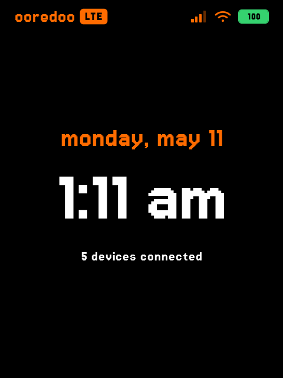
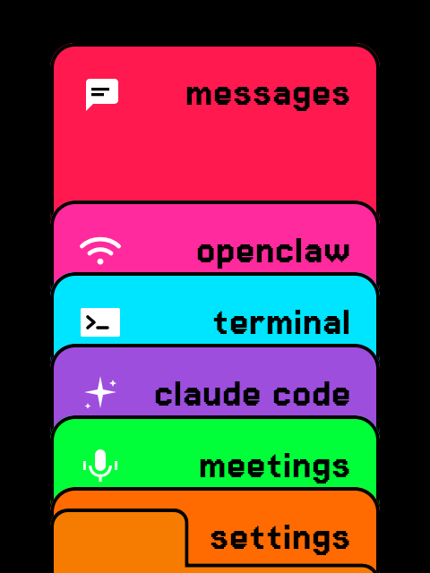
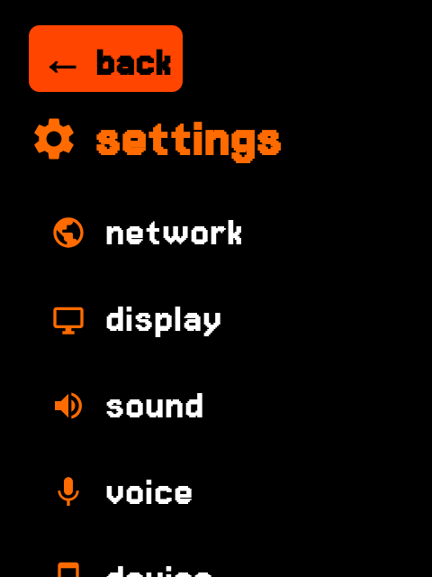
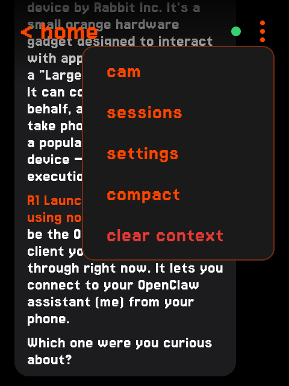
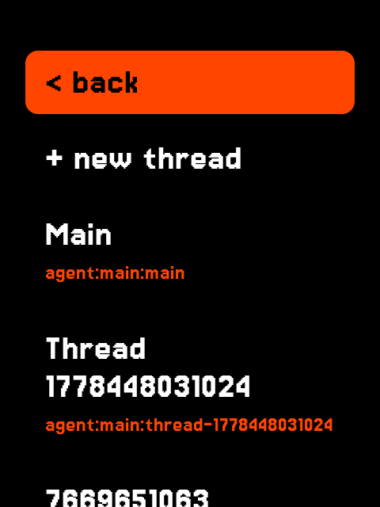
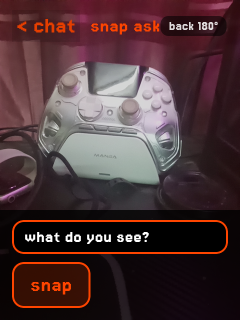

# CarrotOS

A custom Android 14 ROM for the **Rabbit R1**, with a single-app kiosk launcher baked in.

> Built by **khalifa007**.

[](https://github.com/khalifa007/rabbitR1Luncher)

---

## Screenshots

| | | |
|:---:|:---:|:---:|
|  |  |  |
| home / clock | app drawer | settings |
|  |  |  |
| openclaw chat | thread browser | snap & ask camera |

---

## Download

Get the latest flashable zip from **[Releases](../../releases/latest)**.

---

## What you need

1. A **Rabbit R1** with stock Rabbit OS already installed.
2. A **Chromium-based browser** (Chrome / Edge / Brave). Firefox doesn't support WebUSB.
3. A USB-C cable (the one you charge with).
4. Only for the script path: **Android platform-tools** (so `fastboot` and `adb` are in your `PATH`) — <https://developer.android.com/studio/releases/platform-tools>. The web flasher does not need this.

---

## How to flash

Two ways. Pick whichever you prefer — both produce the same result.

### Option A — Web flasher (recommended, no install)

The easiest path. Everything happens in your browser; no platform-tools, no terminal.

1. Download and unzip the latest release from **[Releases](../../releases/latest)**.
2. Open **<https://khalifa007.github.io/carrotOS/>** in Chrome / Edge / Brave.
3. Follow the on-screen steps:
   - **00 hello** — unlock your R1's bootloader from rabbithole (one-time, link is on the page).
   - **01 images** — drop in `system.img`, `vbmeta.img`, and `vendor.img` from the unzipped release.
   - **02 connect** — plug in the R1, get it into fastboot, click Connect, authorize WebUSB.
   - **03 → 05** — confirm settings, hit flash, wait for the carrot.

Total time: ~2 minutes once unlocked.

### Option B — Script

For people who already have `fastboot` installed and prefer a CLI.

**1. Boot your R1 into fastboot.** Stock Rabbit OS has no Developer Options and no adb, so the only way to enter fastboot from a stock device is the official web flasher:

1. Open <https://rabbit-hmi-oss.github.io/flashing/> in Chrome / Edge / Brave.
2. Click **Connect**, select your R1.
3. Use the option to enter **Bootloader / Fastboot** mode.

Verify with:

```
fastboot devices
```

You should see one device listed.

**2. Run the flasher.** Download and unzip the latest release, then:

**Linux / macOS:**
```
chmod +x flash.sh
./flash.sh
```

**Windows:** double-click `flash.bat`.

The script unlocks the bootloader (auto, no prompt), wipes userdata, and flashes `vbmeta`, `vendor`, and `system`. Total time: ~2 minutes.

### First boot

When you see the **carrot logo**, you're booting CarrotOS. Cold boot is ~20 seconds.

---

## Stuck device? (Linux only)

If the web flasher won't connect — for example, the BROM/Preloader window closes faster than you can click — download `catch_fastboot.sh` from the [Release page](../../releases/latest) and run it. It polls USB at 50 ms and drives the device into fastboot automatically.

Prerequisite: [mtkclient](https://github.com/bkerler/mtkclient) cloned at `~/mtkclient` with its Python deps installed (the script tells you the exact commands if it's missing).

---

## Recovery

To go back to stock Rabbit OS at any time:

1. Boot into MT65 Preloader via <https://rabbit-hmi-oss.github.io/flashing/>.
2. Flash the official Rabbit OS firmware zip.

You can also re-flash CarrotOS by running `flash.sh` / `flash.bat` again.

---

## What CarrotOS does differently

- **Single-app kiosk.** The R1 launcher is the only home — status bar, nav bar, and lock screen are hidden.
- **Camera swivel motor wired up.** The lens rotates to back-facing when you open the QR scanner or camera, and returns to idle when you close them.
- **CDMA crash fixed.** The stock vendor RIL crash-loops on every clean wipe; CarrotOS forces the network mode to LTE/GSM/WCDMA so the RIL stays stable.
- **Slimmed.** ~30 packages stripped (Dialer, Browser2, Contacts, MmsService, Updater, etc.).
- **Silent boot.** Default notification + UI sounds removed from the build.
- **AOT-compiled framework.** No JIT cost on framework code, fast cold boot.

Launcher source: **[khalifa007/rabbitR1Luncher](https://github.com/khalifa007/rabbitR1Luncher)**

---

## Security caveat

CarrotOS exposes an **unauthenticated root shell on `127.0.0.1:1337`** (used by the launcher to drive the camera motor and manage WiFi). Any app installed on the device can talk to it as root. Since this is a kiosk and only the bundled launcher runs, this is acceptable for now — but **do not install untrusted third-party apps**.

---

## Warranty

This is a community ROM with **no warranty**. Flashing custom firmware may void your OEM warranty and carries a small risk of bricking. You can always recover via the Rabbit OS web flasher.

---

CarrotOS — by khalifa007
